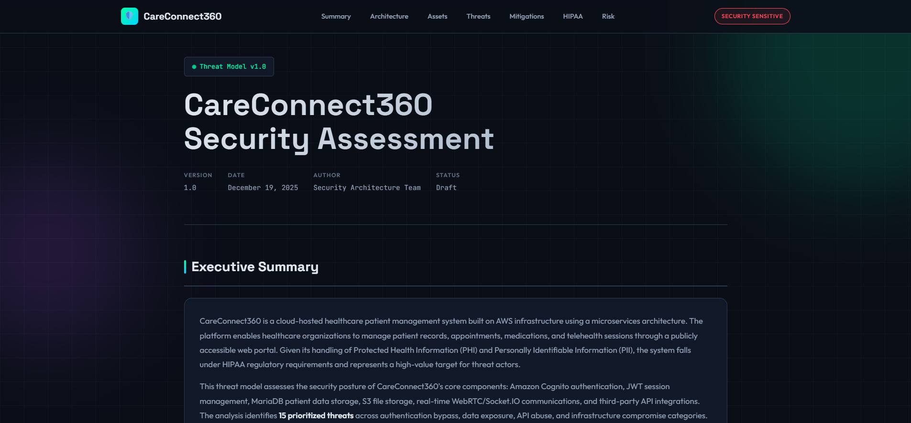

# Healthcare Threat Model: STRIDE Analysis for HIPAA-Compliant Patient Management System

A comprehensive security threat model for CareConnect360, a cloud-hosted healthcare platform handling PHI and PII data. Identifies 15 prioritised threats across authentication, data protection, API security, and infrastructure—mapped to HIPAA Security Rule requirements with actionable remediation guidance.

## Overview

Healthcare organisations face relentless pressure to digitise patient care while protecting highly regulated data. CareConnect360 represents a realistic AWS-hosted patient management system with common architectural patterns: React frontend, Node.js API, MariaDB database, Cognito authentication, and real-time telehealth capabilities via WebRTC. The question isn't whether vulnerabilities exist—it's whether the organisation has identified them before attackers do.

This threat model applies the STRIDE methodology (Spoofing, Tampering, Repudiation, Information Disclosure, Denial of Service, Elevation of Privilege) to systematically analyse trust boundaries and data flows across the architecture. Each threat is assessed for business impact, mapped to relevant HIPAA §164 controls, and paired with concrete remediation code. The output is a prioritised risk register that a security team could action immediately.

The model demonstrates how threat modelling shifts security left—catching issues like JWT algorithm confusion, S3 bucket misconfigurations, and IDOR vulnerabilities during design rather than in production incident response.

## Architecture

The system spans five trust boundaries: a public-facing DMZ (WAF and ALB), application tier (React, Node.js, Lambda, WebRTC, Socket.IO), authentication services (Cognito with 2FA, JWT tokens), data tier (MariaDB for patient records, S3 for documents), and monitoring infrastructure (Prometheus, ELK Stack). External integration with MedTrack Pro introduces third-party supply chain considerations.

Data flows from healthcare staff and patients through AWS WAF to the React frontend, with the Node.js API orchestrating authentication via Cognito, CRUD operations against MariaDB, file storage in S3, and real-time telehealth sessions. The architecture diagram in the threat model visualises these boundaries and highlights where trust transitions occur—the critical points where controls must exist.

## Tech Stack

**Frameworks**: STRIDE, MITRE ATT&CK, NIST Cybersecurity Framework, Cyber Kill Chain  
**Compliance**: HIPAA Security Rule (§164.308–312)  
**Target Platform**: AWS (EC2, Cognito, S3, Lambda, WAF, Secrets Manager)  
**Application Stack**: React, Node.js/Express, MariaDB, WebRTC, Socket.IO  
**Security Tools**: JWT, AWS Secrets Manager, Content Security Policy  

## Key Decisions

- **STRIDE over attack trees**: STRIDE provides systematic coverage of threat categories rather than scenario-specific paths. For a HIPAA-regulated system, this ensures no category of threat is overlooked during initial analysis.

- **HIPAA control mapping**: Each threat links directly to specific Security Rule references (§164.312, etc.), making the model immediately useful for compliance teams and auditors—not just security engineers.

- **Remediation code examples**: Abstract recommendations ("implement secure token storage") are replaced with working code snippets. This bridges the gap between security architects who identify risks and developers who must fix them.

- **Risk prioritisation over completeness**: Eight threats marked high-risk with immediate remediation required; seven medium-risk for 30-day planning. This acknowledges that security is resource-constrained and not everything can be fixed at once.

## Screenshots

[View Interactive Threat Model](https://nfroze.github.io/Healthcare-Threat-Model-STRIDE-Analysis/threatmodel.html)

## Author

**Noah Frost**

- Website: [noahfrost.co.uk](https://noahfrost.co.uk)
- GitHub: [github.com/nfroze](https://github.com/nfroze)
- LinkedIn: [linkedin.com/in/nfroze](https://linkedin.com/in/nfroze)
