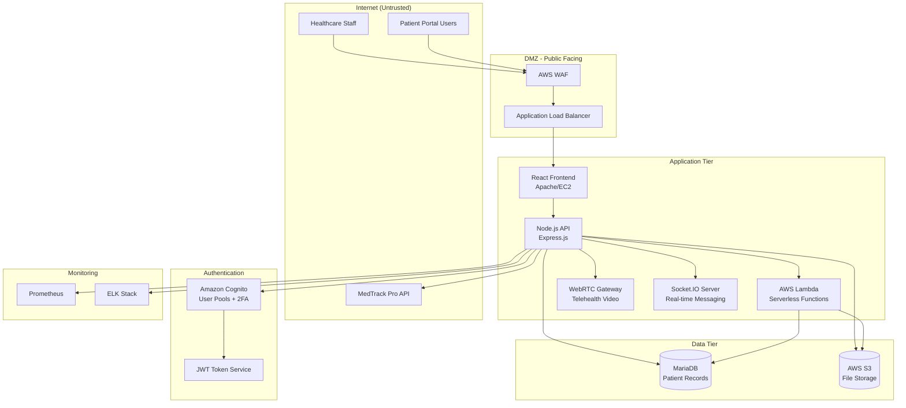

# CareConnect360 Threat Model

**Version:** 1.0  
**Date:** December 19, 2025  
**Classification:** Internal – Security Sensitive  
**Author:** Security Architecture Team  
**Review Status:** Draft

---

## Executive Summary

CareConnect360 is a cloud-hosted healthcare patient management system built on AWS infrastructure using a microservices architecture. The platform enables healthcare organizations to manage patient records, appointments, medications, and telehealth sessions through a publicly accessible web portal. Given its handling of Protected Health Information (PHI) and Personally Identifiable Information (PII), the system falls under HIPAA regulatory requirements and represents a high-value target for threat actors.

This threat model assesses the security posture of CareConnect360's core components: Amazon Cognito authentication, JWT session management, MariaDB patient data storage, S3 file storage, real-time WebRTC/Socket.IO communications, and third-party API integrations. The analysis identifies 15 prioritized threats across authentication bypass, data exposure, API abuse, and infrastructure compromise categories.

**Key Findings:** The current architecture has significant gaps in JWT validation hardening, S3 access controls, WebRTC TURN server authentication, and audit logging completeness. Eight high-risk threats require immediate remediation to achieve acceptable HIPAA compliance posture. The third-party integration with MedTrack Pro introduces supply chain risk that is not adequately addressed by current controls.

---

## Architecture Diagram



---

## Assets Inventory

| Asset | Description | Data Classification | Owner | Storage Location |
|-------|-------------|---------------------|-------|------------------|
| Patient Records | Name, DOB, SSN, address, medical history | PHI/PII – Critical | Data Team | MariaDB |
| Medical Documents | Lab results, imaging, prescriptions | PHI – Critical | Data Team | S3 |
| User Credentials | Passwords, MFA secrets, session tokens | Sensitive | Security Team | Cognito |
| Appointment Data | Scheduling, provider assignments | PHI – High | Application Team | MariaDB |
| Medication Records | Prescriptions, dosages, refill history | PHI – Critical | Data Team | MariaDB |
| Telehealth Sessions | Video streams, chat transcripts | PHI – Critical | Application Team | WebRTC/S3 |
| Audit Logs | Access logs, authentication events | Sensitive | Security Team | ELK Stack |
| API Keys | Third-party integration credentials | Sensitive | DevOps Team | AWS Secrets Manager |
| JWT Signing Keys | Token signing/verification keys | Critical | Security Team | Cognito/EC2 |

---

## Threat Register

| ID | Category | Threat | Component | Risk | Status |
|----|----------|--------|-----------|------|--------|
| AUTH-01 | Spoofing | JWT algorithm confusion—attacker substitutes RS256 with HS256 using public key as secret | JWT Authentication | High | Not Addressed |
| AUTH-02 | Spoofing | Cognito user enumeration via differential response timing on login attempts | Amazon Cognito | Medium | Not Addressed |
| AUTH-03 | Elevation of Privilege | JWT token theft via XSS allows session hijacking with full user privileges | Frontend/JWT | High | Partial |
| AUTH-04 | Repudiation | Insufficient logging of authentication failures prevents breach detection | ELK Stack | Medium | Not Addressed |
| DATA-01 | Information Disclosure | S3 bucket misconfiguration exposes patient documents publicly | S3 Storage | High | Not Addressed |
| DATA-02 | Information Disclosure | MariaDB connection strings hardcoded in application code or environment variables | Node.js API | High | Not Addressed |
| DATA-03 | Tampering | SQL injection in patient search endpoint modifies or extracts PHI | MariaDB/API | High | Not Addressed |
| API-01 | Elevation of Privilege | IDOR vulnerability allows patients to access other patients' records via predictable IDs | Patient API | High | Not Addressed |
| API-02 | Denial of Service | Lack of rate limiting enables API abuse and resource exhaustion | Node.js API | Medium | Not Addressed |
| API-03 | Spoofing | MedTrack Pro API key compromise enables unauthorized medication data access | Third-party Integration | High | Not Addressed |
| RTC-01 | Information Disclosure | WebRTC TURN server lacks authentication, allowing unauthorized relay usage | WebRTC Gateway | High | Not Addressed |
| RTC-02 | Information Disclosure | Socket.IO connections lack origin validation, enabling cross-site hijacking | Socket.IO Server | Medium | Not Addressed |
| INFRA-01 | Elevation of Privilege | Lambda function IAM roles overly permissive, enabling lateral movement | AWS Lambda | Medium | Not Addressed |
| INFRA-02 | Information Disclosure | Prometheus metrics endpoint exposed without authentication leaks system info | Prometheus | Medium | Not Addressed |
| INFRA-03 | Tampering | GitHub Actions workflow injection via malicious PR modifies deployment | CI/CD Pipeline | High | Not Addressed |

---

## Mitigations

### AUTH-01: Pin JWT Algorithm in Verification

**Threat:** JWT algorithm confusion attack allows signature bypass

**Recommendation:** Explicitly restrict accepted algorithms during token verification. Never allow the algorithm to be derived from the token header alone.

```javascript
const jwt = require('jsonwebtoken');

const verifyToken = (token) => {
  return jwt.verify(token, publicKey, {
    algorithms: ['RS256'], // Explicitly pin algorithm
    issuer: 'https://cognito-idp.us-east-1.amazonaws.com/YOUR_POOL_ID',
    audience: 'YOUR_CLIENT_ID'
  });
};
```

**Additional Controls:**
- Rotate signing keys quarterly via Cognito key rotation
- Monitor for tokens with unexpected algorithm headers in ELK

---

### AUTH-03: Implement Secure Token Storage

**Threat:** XSS-based JWT theft enables session hijacking

**Recommendation:** Store tokens in HttpOnly cookies instead of localStorage. Implement Content Security Policy headers.

```javascript
// Express.js cookie configuration
res.cookie('accessToken', token, {
  httpOnly: true,
  secure: true,
  sameSite: 'strict',
  maxAge: 3600000 // 1 hour
});
```

**CSP Header Configuration:**

```
Content-Security-Policy: default-src 'self'; script-src 'self'; connect-src 'self' wss://your-domain.com
```

---

### DATA-01: Enforce S3 Private Access

**Threat:** Public bucket exposure leaks patient documents

**Recommendation:** Enable S3 Block Public Access at account level and enforce secure transport via bucket policy.

```json
{
  "Version": "2012-10-17",
  "Statement": [
    {
      "Sid": "DenyInsecureTransport",
      "Effect": "Deny",
      "Principal": "*",
      "Action": "s3:*",
      "Resource": [
        "arn:aws:s3:::careconnect360-patient-docs",
        "arn:aws:s3:::careconnect360-patient-docs/*"
      ],
      "Condition": {
        "Bool": {
          "aws:SecureTransport": "false"
        }
      }
    },
    {
      "Sid": "DenyPublicAccess",
      "Effect": "Deny",
      "Principal": "*",
      "Action": "s3:GetObject",
      "Resource": "arn:aws:s3:::careconnect360-patient-docs/*",
      "Condition": {
        "StringNotEquals": {
          "aws:PrincipalAccount": "YOUR_ACCOUNT_ID"
        }
      }
    }
  ]
}
```

**AWS CLI Verification:**

```bash
aws s3api get-public-access-block --bucket careconnect360-patient-docs
```

---

### DATA-02: Externalize Secrets Management

**Threat:** Hardcoded credentials in code or environment variables

**Recommendation:** Use AWS Secrets Manager with automatic rotation for database credentials.

```javascript
const { SecretsManagerClient, GetSecretValueCommand } = require('@aws-sdk/client-secrets-manager');

const getDbCredentials = async () => {
  const client = new SecretsManagerClient({ region: 'us-east-1' });
  const response = await client.send(
    new GetSecretValueCommand({ SecretId: 'careconnect360/mariadb/prod' })
  );
  return JSON.parse(response.SecretString);
};
```

---

### DATA-03: Implement Parameterized Queries

**Threat:** SQL injection in patient search endpoints

**Recommendation:** Use parameterized queries exclusively. Enable MariaDB query logging for injection attempt detection.

```javascript
// Using mysql2 with prepared statements
const searchPatients = async (searchTerm) => {
  const [rows] = await pool.execute(
    'SELECT id, name, dob FROM patients WHERE name LIKE ? OR mrn = ?',
    [`%${searchTerm}%`, searchTerm]
  );
  return rows;
};
```

**Input Validation Layer:**

```javascript
const Joi = require('joi');

const patientSearchSchema = Joi.object({
  query: Joi.string().max(100).pattern(/^[a-zA-Z0-9\s\-]+$/).required()
});
```

---

### API-01: Implement Authorization Checks for IDOR Prevention

**Threat:** Insecure Direct Object Reference allows cross-patient data access

**Recommendation:** Validate resource ownership on every request. Implement middleware that verifies the authenticated user has access to the requested patient record.

```javascript
const authorizePatientAccess = async (req, res, next) => {
  const requestedPatientId = req.params.patientId;
  const userId = req.user.sub; // From JWT
  
  const hasAccess = await checkPatientAccess(userId, requestedPatientId);
  
  if (!hasAccess) {
    logger.warn('IDOR attempt', { userId, requestedPatientId, ip: req.ip });
    return res.status(403).json({ error: 'Access denied' });
  }
  next();
};

app.get('/api/patients/:patientId', authorizePatientAccess, getPatientHandler);
```

---

### API-03: Secure Third-Party API Integration

**Threat:** MedTrack Pro API key compromise

**Recommendation:** Store API keys in AWS Secrets Manager with rotation. Implement request signing and IP allowlisting.

```javascript
// Rotate keys and use short-lived tokens where supported
const getMedTrackClient = async () => {
  const apiKey = await getSecretValue('careconnect360/medtrack/apikey');
  return axios.create({
    baseURL: 'https://api.medtrackpro.com/v2',
    headers: {
      'X-API-Key': apiKey,
      'X-Request-ID': crypto.randomUUID()
    },
    timeout: 5000
  });
};
```

**Network Controls:**
- Configure VPC endpoints for outbound API calls
- Implement egress filtering to allow only MedTrack Pro IP ranges
- Log all third-party API requests to ELK

---

### RTC-01: Secure WebRTC TURN Server

**Threat:** Unauthenticated TURN server abuse

**Recommendation:** Implement time-limited TURN credentials generated per session.

```javascript
const generateTurnCredentials = (userId) => {
  const timestamp = Math.floor(Date.now() / 1000) + 3600; // 1 hour validity
  const username = `${timestamp}:${userId}`;
  const credential = crypto
    .createHmac('sha1', TURN_SECRET)
    .update(username)
    .digest('base64');
  
  return {
    urls: ['turn:turn.careconnect360.com:443?transport=tcp'],
    username,
    credential
  };
};
```

---

### INFRA-03: Secure GitHub Actions Workflows

**Threat:** Workflow injection via malicious pull requests

**Recommendation:** Require approval for workflows from first-time contributors. Pin action versions to SHA.

```yaml
# .github/workflows/deploy.yml
name: Deploy
on:
  push:
    branches: [main]

permissions:
  contents: read
  id-token: write

jobs:
  deploy:
    runs-on: ubuntu-latest
    environment: production  # Requires approval
    steps:
      - uses: actions/checkout@b4ffde65f46336ab88eb53be808477a3936bae11 # v4.1.1
      - uses: aws-actions/configure-aws-credentials@e3dd6a429d7300a6a4c196c26e071d42e0343502 # v4.0.2
        with:
          role-to-assume: arn:aws:iam::ACCOUNT:role/github-deploy
          aws-region: us-east-1
```

---

## HIPAA Security Rule Mapping

| HIPAA Requirement | §164 Reference | Current State | Gap |
|-------------------|----------------|---------------|-----|
| Access Control | §164.312(a)(1) | Cognito + JWT implemented | IDOR vulnerability (API-01) undermines access control |
| Audit Controls | §164.312(b) | ELK Stack deployed | Insufficient auth failure logging (AUTH-04) |
| Integrity Controls | §164.312(c)(1) | TLS in transit stated | SQL injection risk (DATA-03) threatens integrity |
| Transmission Security | §164.312(e)(1) | TLS/SSL configured | WebRTC TURN lacks auth (RTC-01) |
| Person Authentication | §164.312(d) | 2FA via Cognito | JWT algorithm confusion (AUTH-01) bypasses auth |
| Encryption | §164.312(a)(2)(iv) | At-rest encryption stated | S3 bucket policy gaps (DATA-01) |
| Contingency Plan | §164.308(a)(7) | Not documented | Backup/recovery procedures needed |
| Security Incident | §164.308(a)(6) | Prometheus monitoring | No incident response playbook documented |

### Priority HIPAA Remediation Actions

1. **Immediate:** Address AUTH-01, DATA-01, API-01 to restore access control integrity
2. **30 Days:** Implement comprehensive audit logging covering all PHI access
3. **60 Days:** Document incident response procedures and conduct tabletop exercise
4. **90 Days:** Complete penetration test and remediate findings

---

## Risk Summary

| Risk Level | Count | Immediate Action Required |
|------------|-------|---------------------------|
| High | 8 | Yes – Remediate before next release |
| Medium | 7 | Plan remediation within 30 days |
| Low | 0 | — |

**Overall Risk Posture:** HIGH – Multiple unaddressed vulnerabilities in authentication and data protection create significant breach risk and HIPAA compliance gaps.

---

## References

- OWASP Top 10 2021: https://owasp.org/Top10/
- OWASP API Security Top 10: https://owasp.org/www-project-api-security/
- NIST SP 800-53 Rev. 5 Security Controls: https://csrc.nist.gov/publications/detail/sp/800-53/rev-5/final
- NIST Cybersecurity Framework: https://www.nist.gov/cyberframework
- HHS HIPAA Security Rule Guidance: https://www.hhs.gov/hipaa/for-professionals/security/guidance/
- AWS Well-Architected Security Pillar: https://docs.aws.amazon.com/wellarchitected/latest/security-pillar/
- CWE-287 Improper Authentication: https://cwe.mitre.org/data/definitions/287.html
- CWE-639 Authorization Bypass Through User-Controlled Key: https://cwe.mitre.org/data/definitions/639.html

---

## Document History

| Version | Date | Author | Changes |
|---------|------|--------|---------|
| 1.0 | December 19, 2025 | Security Architecture Team | Initial threat model |

---

*This document contains security-sensitive information. Distribution is limited to authorized personnel with a need to know.*
